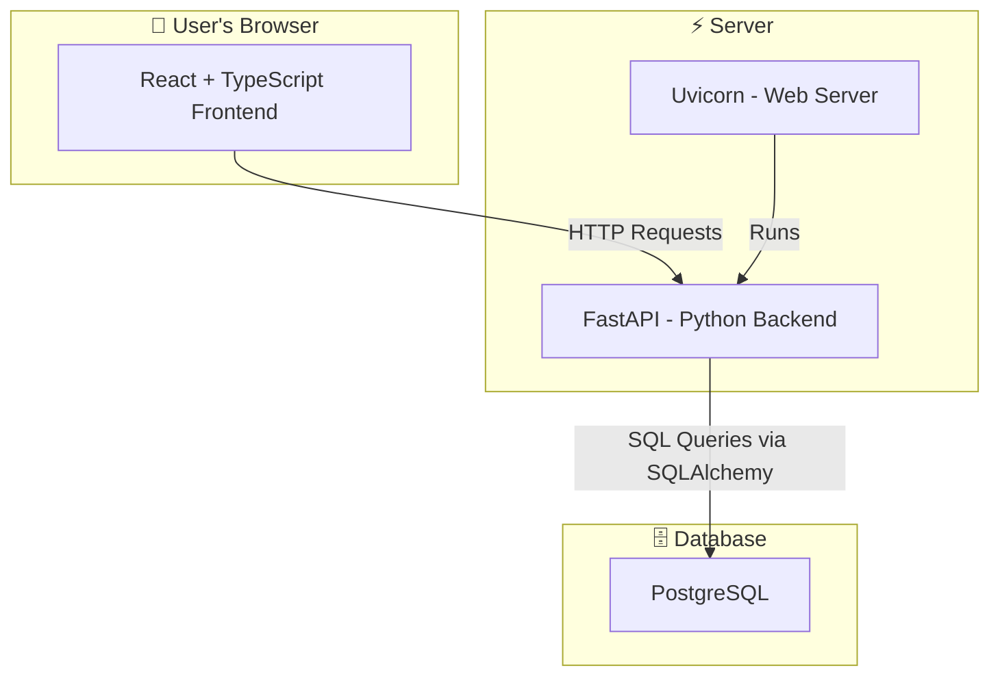
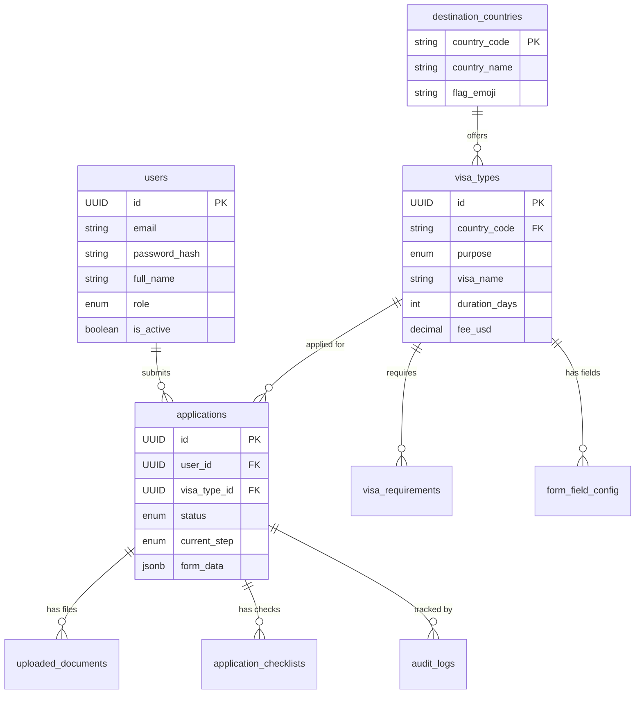
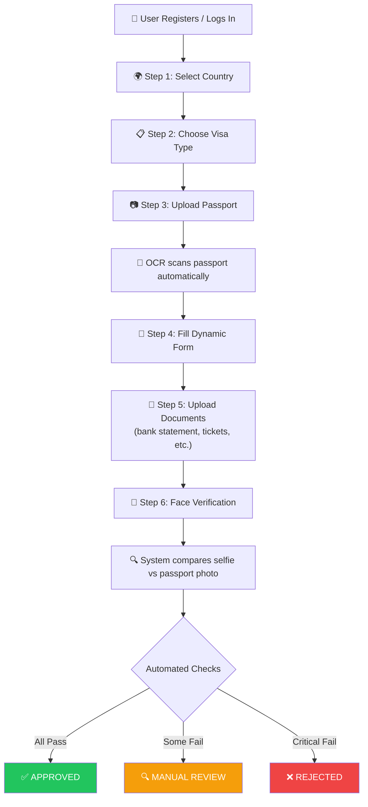

# POC — Architecture & Tech Stack Explained

## What Is This Project?

POC is a **Visa Application Processing System**. Think of it like a smart online form where a person applies for a visa to visit another country (like USA, UK, UAE, etc.)

The system:
1. Lets users **pick a country** and **visa type**
2. **Scans their passport** using OCR (reads text from images)
3. Asks them to **fill a dynamic form** (different questions for different countries)
4. Makes them **upload documents** (bank statements, tickets, etc.)
5. Does **face verification** (matches their selfie with passport photo)
6. Runs **automated checks** and gives a result: ✅ Approved / ❌ Rejected / 🔍 Manual Review

---

## The Tech Stack — What Each Tool Does



### Frontend (What the user sees)

| Technology | What it does | Simple Analogy |
|-----------|-------------|----------------|
| **React** | Builds the user interface (buttons, forms, pages) | The **paint and furniture** of a house |
| **TypeScript** | JavaScript with safety checks — catches errors before they happen | A **spell-checker** for your code |
| **Vite** | Starts the development server super fast | A **fast oven** that bakes your website quickly |
| **TailwindCSS** | Pre-built CSS classes for quick styling | **LEGO blocks** for design — snap them together |

### Backend (The brain behind the scenes)

| Technology | What it does | Simple Analogy |
|-----------|-------------|----------------|
| **FastAPI** | Handles all requests from the frontend (login, submit form, upload files) | The **receptionist** at a hotel |
| **Uvicorn** | The actual server that runs FastAPI | The **building** where the receptionist works |
| **Python** | The programming language everything is written in | The **language** the receptionist speaks |
| **SQLAlchemy** | Talks to the database using Python instead of raw SQL | A **translator** between Python and the database |
| **Alembic** | Manages database changes over time (add/remove tables) | A **diary** that tracks every database change |
| **asyncpg** | The fast driver that connects Python to PostgreSQL | The **highway** between the server and database |

### Database (Where all data is stored)

| Technology | What it does | Simple Analogy |
|-----------|-------------|----------------|
| **PostgreSQL** | Stores all users, applications, documents permanently | A **filing cabinet** that never forgets |
| **pgcrypto** | Generates unique IDs (UUID) for every record | A **label machine** that gives everything a unique name |

---

## Project Folder Structure — What Lives Where

```
POC/
├── backend/                      ← 🧠 The Brain
│   ├── app/
│   │   ├── core/
│   │   │   └── database.py       ← Connects to PostgreSQL
│   │   ├── models/               ← Defines what tables look like in Python
│   │   │   ├── base.py           ← Parent class for all models
│   │   │   ├── enums.py          ← Fixed choices (like dropdown options)
│   │   │   ├── user.py           ← User table definition
│   │   │   ├── country.py        ← Countries table
│   │   │   ├── visa_type.py      ← Visa types table
│   │   │   ├── requirement.py    ← Document requirements table
│   │   │   ├── field_config.py   ← Dynamic form fields table
│   │   │   ├── application.py    ← Visa applications table
│   │   │   ├── document.py       ← Uploaded files table
│   │   │   ├── audit_log.py      ← Activity log table
│   │   │   └── checklist.py      ← Automated check results table
│   │   ├── routers/              ← API endpoints (URLs) — TO BE BUILT
│   │   ├── services/             ← Business logic — TO BE BUILT
│   │   │   ├── ocr/              ← Passport text scanning
│   │   │   ├── face/             ← Face matching
│   │   │   └── visa/             ← Visa processing rules
│   │   ├── schemas/              ← Request/Response format validation — TO BE BUILT
│   │   └── utils/                ← Helper functions
│   ├── alembic/                  ← Database migration tracker
│   ├── uploads/                  ← User-uploaded files
│   │   ├── passports/
│   │   ├── bank_statements/
│   │   ├── documents/
│   │   └── faces/
│   ├── tests/
│   ├── main.py                   ← App entry point
│   ├── requirements.txt          ← Python packages list
│   └── .env                      ← Secret config (NOT on GitLab)
│
├── frontend/                     ← 🎨 The Face
│   ├── src/
│   │   ├── components/           ← Reusable UI pieces
│   │   │   ├── application/      ← The visa application wizard
│   │   │   │   ├── CountrySelector/
│   │   │   │   ├── VisaTypeSelector/
│   │   │   │   ├── PassportUpload/
│   │   │   │   ├── DynamicForm/
│   │   │   │   ├── DocumentUpload/
│   │   │   │   ├── Checklist/
│   │   │   │   └── FaceVerification/
│   │   │   ├── auth/             ← Login/Register
│   │   │   ├── admin/            ← Admin dashboard
│   │   │   └── shared/           ← Buttons, headers, etc.
│   │   ├── pages/                ← Full page views
│   │   ├── services/             ← API call functions
│   │   ├── hooks/                ← Reusable React logic
│   │   ├── types/                ← TypeScript type definitions
│   │   └── utils/                ← Helper functions
│   └── public/assets/
│
├── database/                     ← 📁 SQL Migration Files
│   ├── migrations/               ← 11 SQL files that build the database
│   └── seeds/                    ← Reference data
│
├── .env                          ← Root PostgreSQL credentials
├── .gitignore                    ← Files to hide from GitLab
└── README.md                     ← Setup guide
```

---

## How the Database is Designed

Think of the database as **9 interconnected spreadsheets**:



### What each table stores

| # | Table | What it stores | Example |
|---|-------|----------------|---------|
| 1 | **users** | People who register/login | Shrishti, email, hashed password, role=user |
| 2 | **destination_countries** | Countries you can apply for | 🇺🇸 US, 🇦🇪 UAE, 🇬🇧 UK (10 countries pre-loaded) |
| 3 | **visa_types** | Types of visas per country | US Tourist Visa $160, UAE 30-day Visa $90 (13 pre-loaded) |
| 4 | **visa_requirements** | Documents needed per visa | US Tourist needs: passport, bank statement, photo, tickets |
| 5 | **form_field_config** | Form questions per visa | US Tourist asks: full name, DOB, travel date, criminal record? |
| 6 | **applications** | Each visa application | Shrishti applied for US Tourist Visa, status: under_review |
| 7 | **uploaded_documents** | Files the user uploaded | passport.jpg, bank_statement.pdf, selfie.jpg |
| 8 | **audit_logs** | Who did what and when | "Shrishti submitted application at 2:30 PM" |
| 9 | **application_checklists** | Automated check results | Face match: 94% ✅, Passport valid: ✅, Bank balance: ✅ |

---

## How the Application Flow Works

This is the user journey from start to finish:



### Step-by-step explanation:

**Step 1 — Country Selection**
- User picks a destination (USA, UK, UAE, etc.)
- System loads data from `destination_countries` table

**Step 2 — Visa Type Selection**
- Based on the country, system shows available visa types
- System reads from `visa_types` table (filtered by country)

**Step 3 — Passport Upload**
- User uploads a photo of their passport
- Backend runs **OCR** (Optical Character Recognition) to extract:
  - Full name, passport number, expiry date, nationality
- Extracted data is stored in `applications.passport_mrz_data` as JSON

**Step 4 — Dynamic Form**
- System loads form fields from `form_field_config` table
- Different visa types have different questions
- User fills the form → data stored in `applications.form_data` as JSON

**Step 5 — Document Upload**
- System checks `visa_requirements` table for what documents are needed
- User uploads each required document
- Files saved to `backend/uploads/` folder
- Metadata saved to `uploaded_documents` table

**Step 6 — Face Verification**
- User takes a selfie
- System compares selfie with passport photo
- Generates a similarity score (0.00 to 1.00)
  - ≥ 0.82 → ✅ Auto-pass
  - 0.65 – 0.82 → 🔍 Manual review needed
  - < 0.65 → ❌ Fail

**Automated Decision**
- System creates entries in `application_checklists` table
- Checks: passport valid? bank balance enough? face match? documents complete?
- Final status: `approved`, `rejected`, or `manual_review`

---

## How the Layers Connect

```
User clicks "Submit" on the frontend
        ↓
React sends HTTP POST to /api/applications/submit
        ↓
FastAPI Router receives the request
        ↓
Router calls the Service layer (business logic)
        ↓
Service uses SQLAlchemy Models to read/write database
        ↓
SQLAlchemy sends SQL to PostgreSQL via asyncpg
        ↓
PostgreSQL stores/retrieves data
        ↓
Response travels back up the same chain
        ↓
React shows "Application Submitted! ✅"
```

In code terms:

| Layer | File Location | What it does |
|-------|---------------|--------------|
| **Frontend** | `frontend/src/` | User interface — what people click |
| **API Routes** | `backend/app/routers/` | URL endpoints — where to send requests |
| **Schemas** | `backend/app/schemas/` | Validates request/response data format |
| **Services** | `backend/app/services/` | Business logic — rules and processing |
| **Models** | `backend/app/models/` | Database table definitions in Python |
| **Database** | PostgreSQL `poc_db` | Actual stored data |

---

## Key Concepts Explained

### What is an ORM? (SQLAlchemy)

Instead of writing raw SQL:
```sql
INSERT INTO users (email, password_hash) VALUES ('test@mail.com', 'abc123');
```

You write Python:
```python
user = User(email="test@mail.com", password_hash="abc123")
session.add(user)
await session.commit()
```

**SQLAlchemy translates your Python into SQL automatically.** This is what the files in `backend/app/models/` do — they define what each table looks like in Python.

### What is Async? (asyncpg + asyncio)

Normally, when the server talks to the database, it **waits** — nothing else happens. With **async**, the server can handle **other requests** while waiting for the database. This makes the app much faster under load.

That's why we use:
- `asyncpg` instead of `psycopg2`
- `AsyncSession` instead of `Session`
- `async def` instead of `def`

### What are ENUMs?

ENUMs are **fixed lists of allowed values**. Like a dropdown menu in the database.

Example: `application_status` can ONLY be one of:
- `draft` → User started but didn't submit
- `submitted` → User submitted the application
- `under_review` → Admin is checking it
- `approved` → Visa granted ✅
- `rejected` → Visa denied ❌
- `manual_review` → Needs human judgment 🔍

This prevents anyone from storing invalid values like `"maybe"` or `"idk"`.

### What is JSONB?

JSONB is PostgreSQL's way to store **flexible, structured data** — like a mini-document inside a column.

Example — `form_data` for a US Tourist visa application:
```json
{
  "full_name": "Shrishti Srivastava",
  "date_of_birth": "1999-05-15",
  "passport_number": "P1234567",
  "travel_date": "2026-08-01",
  "purpose_of_visit": "Tourism",
  "criminal_record": false
}
```

This is useful because **different visa types have different form fields**, so we can't have fixed columns.

### What are UUIDs?

Every row in every table has a **UUID** (Universally Unique Identifier) as its ID:
```
a1000001-0000-0000-0000-000000000001
```

This is better than auto-increment (1, 2, 3...) because:
- Can't be guessed (security)
- Can be generated anywhere without conflicts
- Works across multiple servers

---

## What's Built vs What's Coming

| Component | Status |
|-----------|--------|
| Database schema (9 tables) | ✅ Done |
| SQLAlchemy ORM models | ✅ Done |
| SQL migration files (11 files) | ✅ Done |
| Alembic migration setup | ✅ Done |
| Project folder structure | ✅ Done |
| Environment config (.env) | ✅ Done |
| GitLab repo + branching | ✅ Done |
| API routes (routers/) | 🔲 To Be Built |
| Business logic (services/) | 🔲 To Be Built |
| Pydantic schemas (schemas/) | 🔲 To Be Built |
| OCR service | 🔲 To Be Built |
| Face verification service | 🔲 To Be Built |
| Frontend UI (React) | 🔲 To Be Built |
| Authentication (JWT login) | 🔲 To Be Built |
| Admin dashboard | 🔲 To Be Built |
